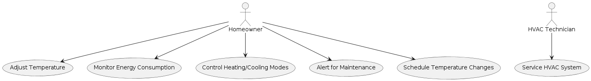
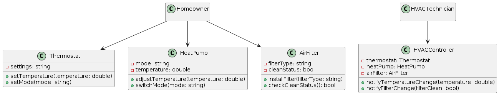
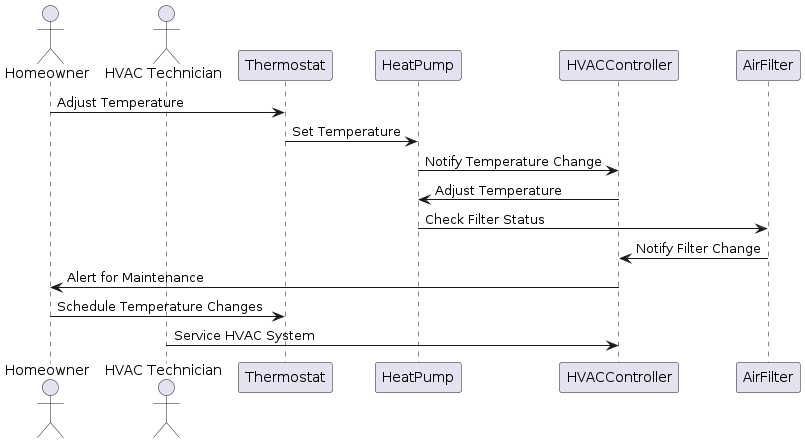
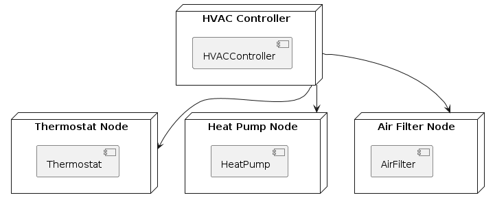

Intent matters.. why are we doing the project , to solve customer problem or improve
our "technical skill" at customer cost.

One key part of Intent is figuring how the project may evolve over time. so we must
have an idea which part of the project can change,  which part of the project usually will not change.

Not knowing this,implies ,design will will  be irrelevant 
from the customer point of view.

If our intent is to solve customer problem then we will focus on higher level of abstraction
usually,that implies avoid things, which add less value to the project.

The byproduct of this intent, is to follow standardized process so that, we get
understandability and repeatability

OOAD main advantage is ,three stake holders 

1. analyst
2. designer.
3. developer 

all of them can use same consistant set of termminologies , this surely aids in communication.
"communicaion gaps" is one of the risks in many projects ,so following ooad may help.

---------------------------------------------------------------
once we know OOAD, UML gives various set of diagrams revealing information according to the stake holder.

for example
User case diagram may help customer get a view about the system.
Use Case Diagrams: Illustrate interactions between actors (users or external systems) and use cases.

Class Diagram and sequence diagram may help the programmer get a view of the system in his/her context.
Class Diagrams: Depict the static structure of a system, showing classes, methods, and attributes.

Sequence Diagrams: Show the order of interactions between objects over time.

so can be the deployment diagram or package diagram give relevant information to the corresponding
stake holders.
you can think of other diagrams like deployment diagram

But the end of the day ,which diagram helps us in the project ,is call we need to take.
Remember from customer perspective diagram is not a high value add. so take a call.

please have a look at the a02BasicsOOADandUML.pdf for more details.

----------------------------------------------------------------------------

Now let us look at design patterns.

Design patterns help us in understanding problems in a generalized way.

let us look at some details.
1. Design patterns is a repeatable commonly recognized and understood solution  
to a design problem, commonly occuring in software.

1. design problem
2. commonly occuring
3. widely accepted solution
4. known advantages and tradeoffs.
5. give some standardized vocabulary to talk about some design scenarios.

Where does it it fit ?
We know we have levels of abstraction how we approach this also, for example consider the below points

1. programming langauge , where we know about variables and functions.
2. oops. where we do know about abstraction, encapsulation, association, inheritance and namespaces.
3. at next level after oo comes design patterns, where we generalize the problem according to commonly
occuring scenarios example in the above, Observer design pattern, strategy, proxy .
4. we can consider framework.. which will give us ready made stuff where by we can focus on the project.
to understand frameworks, knowing design pattern will help
5. of course we have to build a project ,using framework will enable our understanding
of design patterns, hopefully we can come up with good design..

 Example
we might be seeing a button being clicked and some action taking place.
or some request being processed in http protocol, or some interrupt occuring
we reacting to it. if we can generalize this as "Event Handling" then we will
see all the above scenarios as same. 

In design patterns we have a pattern called  "Observer design pattern". 
This pattern helps in implementing Event handling scenario, most of times.

so here comes some things we may consider while using design patterns.

1. Understand the Basics
Before applying design patterns, it's essential to have a solid understanding of what they are and
 why they're useful. Design patterns are typical solutions to common problems in software design.
  They represent best practices used by experienced object-oriented software developers.

2. Learn Common Design Patterns like observer, proxy, strategy, factory, iterator,....
what is common can vary from project to project. so ...
dont byheart this, your project may require a different one.

3. Identify the Problem
Identify the problem or scenario in your design where a pattern might be applicable.
 Patterns are meant to solve specific types of problems, so understanding 
 the problem is crucial.

4. Match Pattern to Problem
Choose a pattern that fits the problem at hand. This requires understanding the context,
forces, and consequences of applying the pattern.

5. Implement the Pattern
Follow the structure and guidelines provided by the pattern to implement it in your design.
This might involve creating specific classes, interfaces, and methods 
that adhere to the pattern's solution.

6. Customize as Necessary
While patterns provide a template, they should be adapted to fit your specific needs.
 Modify the pattern implementation as necessary to better suit your problem.

7. Consider Consequences
Every pattern has trade-offs. Consider the consequences of using a pattern, such 
as increased complexity or performance overhead, and ensure that the 
benefits outweigh the costs in your particular context.

8. Refactor and Iterate
Refactoring existing code to incorporate design patterns can lead to cleaner and more maintainable designs.
 Continuously refactor and iterate on your design to improve its structure and flexibility.

 Example: Applying the Observer Pattern

 Understand the Problem: You have an object (subject) whose state changes frequently, and you need to notify other
  objects (observers) about these changes.

  Match Pattern to Problem: The Observer pattern is suitable for this scenario. It allows an object to 
  publish changes to its state, and other objects to subscribe to and receive updates.

  Let us look at at some code samples and then try to summarize it.

-----------------------------------------------------------------------------------------------
Tips for Effective Use
Remember rules and fools are rhyming words. so becoming fan of any rule is not a good skill for any designer.
Start Simple: Use patterns to solve real problems in your projects. 
Avoid overusing patterns or forcing them into your design unnecessarily.
Learn from Examples: Study how design patterns are used in existing frameworks and libraries.
Practice: Implement various patterns in small projects or coding exercises to gain hands-on experience.
Stay Updated: Design patterns evolve. Stay informed about new patterns and best practices in the industry.

Let us look at some examples now.

1. look at Observer pattern.
2. Look at proxy pattern.
3. Look at decorator pattern.
4. look at factory pattern.

---------------------------------------------------------------------------------------------------------------------

Closing thoughts

common theme is if we have poor or vague understanding of OO, trying to understand
the code becomes a mess.

Even more horrible will be a programmer who does not show rigor in function definition 
and variable usage talking about design patterns.

design != rules.. we can know all the rules, but cannot become a fan of it.
Many  times in design, we can  violate rule provided we justify ,why we violated the rule.

Trying to violate rules for fun is surely irresponsible.

So have data on why we adhered to, 
or violated any rule , including those suggested , by design patterns / OOAD /UML diagrams.

-----------------------------------------------------------------------------------------------------------------
Brief notes about various design patterns.

# Design Patterns using C++ #

1. Factory
To separate the responsbility of object creation from it's user
2. singletone
To limit the number of instances of a class to a maximum of one
3. [Prototype](prototype)
To quickly create multiple objects of a class with similar initial state
4. builder
To assemble a complex object, one step at a time
5. Adapter
To provide a known interface to an unknown object
6. Decorator
To extend an object
7. Proxy
To do pre and post processing anonymously
8. Composite
To treat sum of parts as a whole
9. Mediator
To enable intra-group communication, asynchronously
10. Chain of Responsibility
To escalate conditionally, in a hierarchy
11. State
To build a state machine
12. Template
To create generaic algorithms
13. visitor
To decorate multiple objects in a graph
14. Observer
To enable inter-group communication, asynchronously
15. Strategy
To select algorithm at run-time
16. Abstract Factory
To choose one from multiple factories for same interface

For more info refer to 

Note on concurrency patterns

Concurrency patterns in C++ help manage multiple tasks or threads simultaneously. Here are some key patterns:

1. Multithreading:
   - Achieved using threads, which are the basic units of multitasking.
   - Threads execute concurrently, allowing better program performance and responsiveness.
   - The `<thread>` library in C++ facilitates thread creation and management.

2. Parallelism:
   - Involves executing tasks simultaneously to take advantage of multicore machines.
   - C++11 introduced concurrency features like threads, mutexes, and condition variables.
   - C++17 added parallel algorithms to the Standard Template Library (STL).

3. Active Object:
   - Decouples method invocation from method execution.
   - Uses a separate thread to handle method calls asynchronously.
   - Useful for managing asynchronous tasks without blocking the main thread².

4. Monitor Object:
   - Ensures safe access to shared resources.
   - Combines data and synchronization methods into a single object.
   - Guards access to shared data using locks or semaphores.

5. Half-Sync/Half-Async:
   - Separates synchronous and asynchronous processing.
   - Synchronous part handles high-level logic.
   - Asynchronous part manages low-level details (e.g., I/O, callbacks).

6. Leader/Followers:
   - Manages worker threads efficiently.
   - One thread (leader) handles incoming requests, while others (followers) perform the work.
   - Prevents thread proliferation and improves resource utilization.

7. Thread-Specific Storage:
   - Provides each thread with its own storage space.
   - Useful for maintaining thread-local data (e.g., thread-specific variables).

Remember that choosing the right concurrency pattern depends on your specific use case and requirements!

