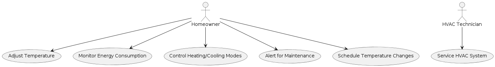
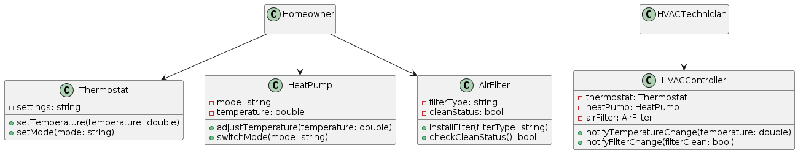

# UML 2.0 #
Understand the Purpose.

Process always needs adaptation, one rule does not fit .choose tools after getting
convinced after the value they provide.

UML helps visualize system design, behavior, and structure.  

many diagrams are there, we will see later on. but as of now.
let us have a look at the following diagrams

Identify the Use Cases:
Start by identifying the use cases relevant to your system. 
These represent specific functionalities or interactions.
Consider examining business workflows to identify candidate use cases.

Select the Appropriate Diagram Type: each diagram may communicate information to different
stakeholders in the project. for example

1. Software Developers:
   - Class Diagrams: Used by developers to model the static structure of classes, their attributes, methods, and relationships.
   - Sequence Diagrams: Useful for understanding interactions between objects or components over time.
   - State Machine Diagrams: Help visualize the behavior of an object or system in response to events.

2. Business Analysts and Product Managers:
   - Use Case Diagrams: Used to capture functional requirements from the user's perspective. They show interactions between actors (users or external systems) and the system.
   - Activity Diagrams: Useful for modeling business processes, workflows, and high-level system behavior.

3. System Architects and Designers:
   - Component Diagrams: Show the high-level structure of a system, including components, interfaces, and dependencies.
   - Deployment Diagrams: Illustrate the physical deployment of software components onto hardware nodes (servers, devices, etc.).

4. Quality Assurance (QA) Teams:
   - Activity Diagrams: Useful for modeling test scenarios and test flows.
   - State Machine Diagrams: Help define test cases based on different system states and transitions.

5. Project Managers and Stakeholder Representatives:
   - Use Case Diagrams: Provide an overview of system functionality and user interactions.
   - Activity Diagrams: Useful for visualizing business processes and project workflows.

6. Documentation Writers and Technical Communicators:
   - Class Diagrams: Used to document the structure of classes and their relationships.
   - Sequence Diagrams: Helpful for explaining system behavior in a step-by-step manner.

example Use case diagram just communicates what is functionality we are expecting from it.

class diagram and sequence diagram may be of interest to technical designers figuring
out what is structure of the code in terms of data types and thier flow in terms of functions.

deployment diagram may be of interest to production or System Architects and Designers:

Choose the UML diagram type that best fits your modeling needs. Common types include:
Use Case Diagrams: Illustrate interactions between actors (users or external systems) and use cases.

Class Diagrams: Depict the static structure of a system, showing classes, methods, and attributes.

Sequence Diagrams: Show the order of interactions between objects over time.

you can think of other diagrams like deployment diagram

so learn the diagrams and think which one we need to use in our project.
Create a Rough Sketch:

Before using a UML modeling tool, consider creating a rough sketch on paper or a whiteboard.
This helps you visualize the high-level structure and connections1.

Most important remember, think what adds real value and then do it. 

1. PlantUML, you can write in text and ask the tool to create the UML diagram.
2. STARUML
3. draw.io

lot of other tools are also avaiable prefer what the company prefers.

## 1. Structural Diagrams ##
Presents structural aspects of a system.

1.1. [Class Diagrams](class-diagrams.md)
1.2. [Package Diagrams](package-diagrams.md)
1.3. [Component Diagrams](component-diagrams.md)
1.4. [Deployment Diagrams](deployment-diagrams.md)

## 2. Behavioral Diagrams ##
Presents the dynamic aspects of a system.

2.1. [Usecase Diagrams](usecase-diagrams.md)
2.2. [Activity Diagrams](activity-diagrams.md)
2.3. [Statechart Diagrams](state-diagrams.md)
2.4. [Sequence Diagrams](sequence-diagrams.md)
