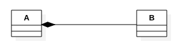
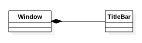

### 1.1. Class Diagram ###

Class diagram presents the classes of the objects and their relationships.

#### 1.1.1. Class ####
Consists of three compartments: Name, State and Behavior.


State is a set of attributes and behavior is a set of operations.


```
    class Book {
        private:
            int isbn;
            string title;
            Set<string> authors;
            boolean available = false;
            double value = 0;
            double discount = 0;
            double price = 0;
        public:
            Book() {

            }

            void print() {

            }
    }
```

#### 1.1.2. Association ####

Association represents "uses and leaves" relationship. 


Can be bi-directional as well.


Objects in a relation play a role and the cardinality can be one-to-one, one-to-many and etc., 


An illustration:

```
class Security {
    private CredentialStore store;
    ....
}
```


#### 1.1.3. Aggregation ####

Represents "owns and share" relationship.


Illustration: A connection pool is manages 5 connections for its clients. 

```
class ConnectionPool {
    private Connection[5] connections;
    ...
}
```


#### 1.1.4. Composition ####

Represents "part-of" relationship. The part is destroyed along with the whole. 



Illustration: The TitleBar is part of a Window.



#### 1.1.5. Dependency ####

Represents "uses and throws" relationship. 


#### 1.1.6. Association Class ####

Represents the details of an association.


#### 1.1.7. Generalization ####

Represents "is-a" relation. The derived object "is-a" special kind of base object.


#### 1.1.8. Interface ####

Represents service contract. 


Illustration:


#### 1.1.9. Realization ####

Represents implementation of a contract. 


Illustration: 


#### 1.1.10. Class Diagram Illustration ####


plantuml for classdiagram
##plant uml usage


@startuml
class Thermostat {
    - settings: string
    + setTemperature(temperature: double)
    + setMode(mode: string)
}

class HeatPump {
    - mode: string
    - temperature: double
    + adjustTemperature(temperature: double)
    + switchMode(mode: string)
}

class AirFilter {
    - filterType: string
    - cleanStatus: bool
    + installFilter(filterType: string)
    + checkCleanStatus(): bool
}

class HVACController {
    - thermostat: Thermostat
    - heatPump: HeatPump
    - airFilter: AirFilter
    + notifyTemperatureChange(temperature: double)
    + notifyFilterChange(filterClean: bool)
}

Homeowner --> Thermostat
Homeowner --> HeatPump
Homeowner --> AirFilter
HVACTechnician --> HVACController

@enduml

@startuml
class HVACComponent {
    + setMediator(mediator: HVACMediator)
}

class Thermostat {
    - settings: string
    + setTemperature(temperature: double)
    + setMode(mode: string)
}

class HeatPump {
    - mode: string
    - temperature: double
    + adjustTemperature(temperature: double)
    + switchMode(mode: string)
}

class AirFilter {
    - filterType: string
    - cleanStatus: bool
    + installFilter(filterType: string)
    + checkCleanStatus(): bool
}

interface HVACMediator {
    + notifyTemperatureChange(temperature: double)
    + notifyFilterChange(filterClean: bool)
}

class HVACController {
    - thermostat: Thermostat
    - heatPump: HeatPump
    - airFilter: AirFilter
    + notifyTemperatureChange(temperature: double)
    + notifyFilterChange(filterClean: bool)
}

HVACComponent --|> HVACMediator
Thermostat --|> HVACComponent
HeatPump --|> HVACComponent
AirFilter --|> HVACComponent
HVACController --> Thermostat
HVACController --> HeatPump
HVACController --> AirFilter
@enduml


