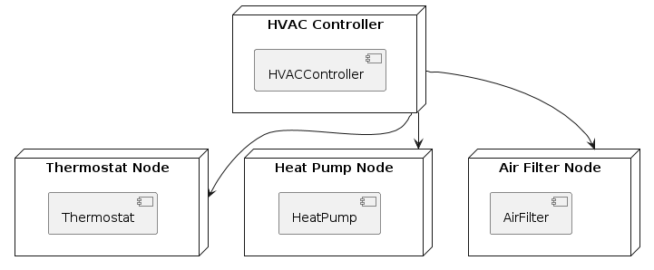

### 1.4. Deployment Diagram ###
Represents association between logical artifacts and physical devices.

#### 1.4.1. Node ####

A physical machine, device, environment and etc., 

#### 1.4.2. Node Relations ####

A component might be deployed on to a node.

An artifact like configuration file and etc., might be deploed on to a node.

Two nodes might be connected physically via network and etc., 

#### 1.4.3. Deployment Diagram Illustration ####

@startuml
node "HVAC Controller" as controller {
    component "HVACController" as hvacController
}

node "Thermostat Node" as thermostatNode {
    component "Thermostat" as thermostat
}

node "Heat Pump Node" as heatPumpNode {
    component "HeatPump" as heatPump
}

node "Air Filter Node" as airFilterNode {
    component "AirFilter" as airFilter
}

controller --> thermostatNode
controller --> heatPumpNode
controller --> airFilterNode
@enduml

