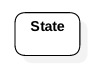
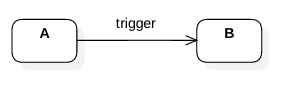
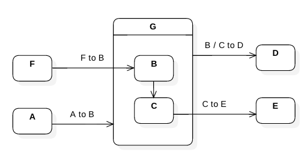
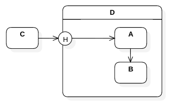
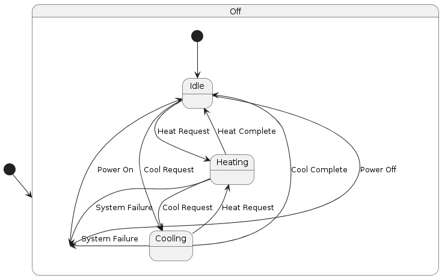

### 2.3. State Chart Diagram ###
Represents the system as a state machine.

#### 2.3.1. State ####
A snapshot of the system at a given time.

#### 2.3.2. State Transitions ####

Every state machine have an initial state.

Every state machine have a terminal state.

System moves from one state to another state up on a trigger/event/etc., 

The triggered transition may happen only if a pre-condition is satisfied.

Each system may take certain actions upon entering a state, while in the given state and while leaving the state.

#### 2.3.3. Kinds of States ####

A composite state is a super state of several sub states.

Illustration: Composite State

Transition to a compisite state always invokes the first sub state unless specified. A history vertex enables transition to the last active state, instead.

A substatemachine is a re-usable unit like procedure.

An orthogonal state is a composite state with parallel transitions.

Illustration: Orthogonal state

The HVAC system starts in the Off state.
When powered on, it transitions to the Idle state.
From Idle, it can move to either Heating or Cooling based on user requests.
Transitions occur when heating or cooling is complete or when there’s a system failure.

@startuml
[*] --> Off

state Off {
    [*] --> Idle
    Idle --> Heating : Heat Request
    Idle --> Cooling : Cool Request
}

state Heating {
    Heating --> Idle : Heat Complete
    Heating --> Cooling : Cool Request
}

state Cooling {
    Cooling --> Idle : Cool Complete
    Cooling --> Heating : Heat Request
}

Off --> Idle : Power On
Idle --> Off : Power Off
Cooling --> Off : System Failure
Heating --> Off : System Failure
@enduml
